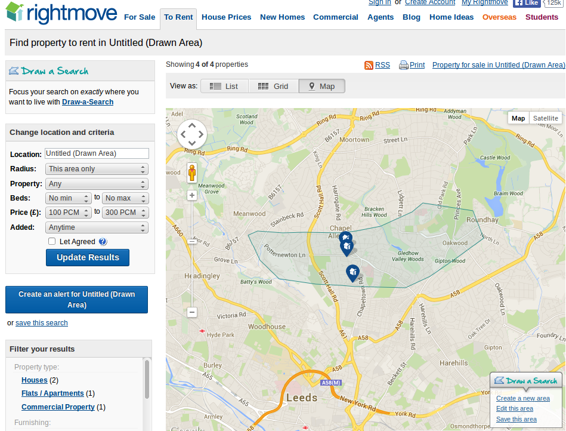

## Part 1: Introduction!


Servers can do more than 'just' moving information around

```{r, echo=FALSE}
# beyond using the internet
# as a glorfied giant hard disk and visualisation tool
```

## Re-cap

- Interesting ways we've moved things around
- Analysis mostly limited visualisation options
- Let's *do* GIS online


## Lecture structure

- What is the cloud and what can it do?
- Applications
- Geoprocessing 'in the cloud'
- The Web Processing Service
- Next steps

##II What is the cloud? 

```{r, echo=FALSE}
# Section 1
```

## The cloud


False idol painting, *circa 1420-30* Creative Commons Attribution from [wellcomeimages.org](http://wellcomeimages.org/) - the cloud has downsides!

## The advantages of 'cloud computing'


## Processing in the cloud


##Applications

## Application I: participatory transport planning


## Application II: AURIN

- The Australian Urban Research Institute
- A 'workbench for 
- ~$20 million over 5 years
- Serving data on water, health, economy, crime etc.
- "data describing one of the above should be gathered and stored in
a manner allowing cross-analysis with other datasets". Source:
[Aurin.org.au](http://aurin.org.au/wp-content/uploads/2014/07/AURIN_Investment_Plan.pdf)

## Application III: Housing search on rightmove.co.uk



Source: [Rightmove.co.uk](http://www.rightmove.co.uk/)

## *Geo*processing in the cloud I


WPS in practice (source: [Stollberg, 2006](http://okgis.i3mainz.hs-mainz.de/1_Container/foreignSites/stollberg/index.html))

## Geoprocessing in the cloud II


Source: [AURIN](https://aurin.org.au/)

##The Web Processing Service (WPS)

##What is the WPS?

##Next steps


- Just a morsel of very large subject
- Potentially very rewarding pass-time - play around!

## References


